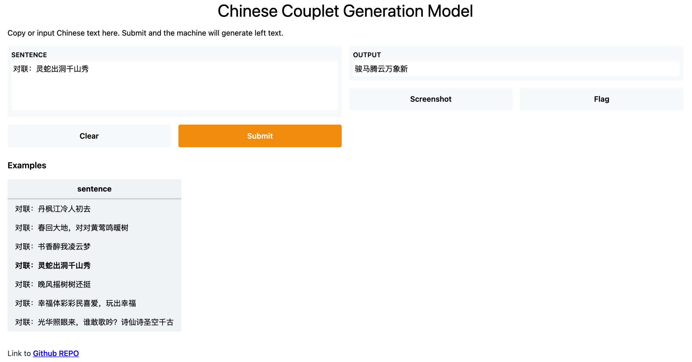

[](https://badge.fury.io/py/textgen)
[](https://pepy.tech/project/textgen)
[](CONTRIBUTING.md)
[](https://github.com/shibing624/textgen/graphs/contributors)
[](LICENSE)
[](requirements.txt)
[](https://github.com/shibing624/textgen/issues)
[](#Contact)

# TextGen

🌈 Implementation of Text Generation models.

**textgen**实现了多种文本生成模型，包括：UDA、GPT2、Seq2Seq、BART、T5、SongNet等模型，开箱即用。

**Guide**

- [Question](#Question)
- [Solution](#Solution)
- [Feature](#Feature)
- [Install](#install)
- [Usage](#usage)
- [Contact](#Contact)
- [Reference](#reference)

# Question

文本生成，文本数据增强怎么做？

# Solution
## 文本生成模型

1. Seq2Seq、ConvSeq2Seq、BART
2. GPT2、SongNet
3. T5、CopyT5

## 文本扩增
### 词粒度扩增
1. UDA，非核心词替换
2. EDA，简单数据增强技术：相似词、同义词替换，随机词插入、删除、替换

### 句粒度扩增
1. 回译（BT, Back Translate）：中文-英文-中文
2. GPT2模型续写：短文本->长文本
3. BART摘要模型：长文本->短文本
4. TGLS：无监督相似文本生成模型


# Feature

- [UDA(非核心词替换)/EDA](textgen/augment/word_level_augment.py)：本项目参考Google的UDA(非核心词替换)算法和EDA算法，基于TF-IDF将句子中部分不重要词替换为同义词，随机词插入、删除、替换等方法，产生新的文本，实现了文本扩增
- [BT(回译)](textgen/augment/sentence_level_augment.py)：本项目基于百度翻译API实现了回译功能，先把中文句子翻译为英文，再把英文翻译为新的中文
- [Seq2Seq](textgen/seq2seq)：本项目基于PyTorch实现了Seq2Seq、ConvSeq2Seq、BART模型的训练和预测，可以用于文本翻译、对话生成、摘要生成等文本生成任务
- [T5](textgen/t5)：本项目基于PyTorch实现了T5和CopyT5模型训练和预测，可以用于文本翻译、对话生成、对联生成、文案撰写等文本生成任务
- [GPT2](textgen/language_modeling)：本项目基于PyTorch实现了GTP2模型训练和预测，可以用于文章生成、对联生成等文本生成任务
- [SongNet](textgen/language_modeling/songnet_model.py)：本项目基于PyTorch实现了SongNet模型训练和预测，可以用于规范格式的诗词、歌词等文本生成任务
- [TGLS](textgen/unsup_generation)：本项目实现了[TGLS](https://www.jiqizhixin.com/articles/2020-08-11-5)无监督相似文本生成模型，是一种“先搜索后学习”的文本生成方法，通过反复迭代学习候选集，最终模型能生成类似候选集的高质量相似文本


# Demo

HuggingFace Demo: https://huggingface.co/spaces/shibing624/chinese-couplet-generate



run example: [examples/gradio_demo.py](examples/gradio_demo.py) to see the demo:

```shell
python examples/gradio_demo.py
```

model trained by [examples/T5/T5_Finetune_Chinese_Couplet.ipynb](https://github.com/shibing624/textgen/blob/main/examples/T5/T5_Finetune_Chinese_Couplet.ipynb)

# Install

```shell
pip install torch # conda install pytorch
pip install -U textgen
```

or

```shell
pip install torch # conda install pytorch
git clone https://github.com/shibing624/textgen.git
cd textgen
python3 setup.py install
```

# Usage

## ConvSeq2Seq 模型
训练并预测ConvSeq2Seq模型：

example: [examples/seq2sesq/training_convseq2seq_model_demo.py](examples/seq2seq/training_convseq2seq_model_demo.py)

```python
import argparse
from loguru import logger
import sys

sys.path.append('../..')
from textgen.seq2seq.conv_seq2seq_model import ConvSeq2SeqModel


def main():
    parser = argparse.ArgumentParser()
    parser.add_argument('--train_file', default='../data/zh_dialog.tsv', type=str, help='Training data file')
    parser.add_argument('--do_train', action='store_true', help='Whether to run training.')
    parser.add_argument('--do_predict', action='store_true', help='Whether to run predict.')
    parser.add_argument('--output_dir', default='./outputs/convseq2seq_zh/', type=str, help='Model output directory')
    parser.add_argument('--max_seq_length', default=50, type=int, help='Max sequence length')
    parser.add_argument('--num_epochs', default=200, type=int, help='Number of training epochs')
    parser.add_argument('--batch_size', default=32, type=int, help='Batch size')
    args = parser.parse_args()
    logger.info(args)

    if args.do_train:
        logger.info('Loading data...')
        model = ConvSeq2SeqModel(epochs=args.num_epochs, batch_size=args.batch_size,
                                 model_dir=args.output_dir, max_length=args.max_seq_length)
        model.train_model(args.train_file)
        print(model.eval_model(args.train_file))

    if args.do_predict:
        model = ConvSeq2SeqModel(epochs=args.num_epochs, batch_size=args.batch_size,
                                 model_dir=args.output_dir, max_length=args.max_seq_length)
        sentences = ["什么是ai", "你是什么类型的计算机", "你知道热力学吗"]
        print("inputs:", sentences)
        print('outputs:', model.predict(sentences))


if __name__ == '__main__':
    main()
```

output:

```bash
inputs: ["什么是ai", "你是什么类型的计算机", "你知道热力学吗"]
outputs: ['人工智能是工程和科学的分支,致力于构建思维的机器。', '我的程序运行在python,所以我在任何运脑上工作！', '我不能错热是一个疯狂的人工智能"200年。']
```

## BART 模型
训练并预测BART模型：

example: [examples/seq2sesq/training_bartseq2seq_zh_demo.py](examples/seq2seq/training_bartseq2seq_zh_demo.py)


output:

```shell
inputs: ['什么是ai', '你是什么类型的计算机', '你知道热力学吗']
outputs: ['人工智能是工程和科学的分支,致力于构', '我的程序运行在python,所以我在任何电脑上', '什么是热力学吗？']
```


## T5 模型

example: [examples/T5/training_zh_t5_model_demo.py](https://github.com/shibing624/textgen/blob/main/examples/T5/training_zh_t5_model_demo.py)

```python
import argparse
from loguru import logger
import pandas as pd
import sys

sys.path.append('../..')
from textgen.t5 import T5Model


def load_data(file_path):
    data = []
    with open(file_path, 'r', encoding='utf-8') as f:
        for line in f:
            line = line.strip('\n')
            terms = line.split('\t')
            if len(terms) == 2:
                data.append(['QA', terms[0], terms[1]])
            else:
                logger.warning(f'line error: {line}')
    return data


def main():
    parser = argparse.ArgumentParser()
    parser.add_argument('--train_file', default='../data/zh_dialog.tsv', type=str, help='Training data file')
    parser.add_argument('--model_type', default='t5', type=str, help='Transformers model type')
    parser.add_argument('--model_name', default='Langboat/mengzi-t5-base', type=str, help='Transformers model or path')
    parser.add_argument('--do_train', action='store_true', help='Whether to run training.')
    parser.add_argument('--do_predict', action='store_true', help='Whether to run predict.')
    parser.add_argument('--output_dir', default='./outputs/mengzi_t5_zh/', type=str, help='Model output directory')
    parser.add_argument('--max_seq_length', default=50, type=int, help='Max sequence length')
    parser.add_argument('--num_epochs', default=10, type=int, help='Number of training epochs')
    parser.add_argument('--batch_size', default=32, type=int, help='Batch size')
    args = parser.parse_args()
    logger.info(args)

    if args.do_train:
        logger.info('Loading data...')
        # train_data: Pandas DataFrame containing the 3 columns - `prefix`, `input_text`, `target_text`.
        #   - `prefix`: A string indicating the task to perform. (E.g. `"question"`, `"stsb"`)
        #   - `input_text`: The input text. `prefix` is prepended to form the full input. (<prefix>: <input_text>)
        #   - `target_text`: The target sequence
        train_data = load_data(args.train_file)
        logger.debug('train_data: {}'.format(train_data[:10]))
        train_df = pd.DataFrame(train_data, columns=["prefix", "input_text", "target_text"])

        eval_data = load_data(args.train_file)[:10]
        eval_df = pd.DataFrame(eval_data, columns=["prefix", "input_text", "target_text"])

        model_args = {
            "reprocess_input_data": True,
            "overwrite_output_dir": True,
            "max_seq_length": args.max_seq_length,
            "train_batch_size": args.batch_size,
            "num_train_epochs": args.num_epochs,
            "save_eval_checkpoints": False,
            "save_model_every_epoch": False,
            "evaluate_generated_text": True,
            "evaluate_during_training": True,
            "evaluate_during_training_verbose": True,
            "use_multiprocessing": True,
            "save_best_model": True,
            "output_dir": args.output_dir,
            "use_early_stopping": True,
        }
        # model_type: t5  model_name: Langboat/mengzi-t5-base
        model = T5Model(args.model_type, args.model_name, args=model_args)

        def count_matches(labels, preds):
            logger.debug(f"labels: {labels[:10]}")
            logger.debug(f"preds: {preds[:10]}")
            match = sum([1 if label == pred else 0 for label, pred in zip(labels, preds)])
            logger.debug(f"match: {match}")
            return match

        model.train_model(train_df, eval_data=eval_df, matches=count_matches)
        print(model.eval_model(eval_df, matches=count_matches))

    if args.do_predict:
        model = T5Model(args.model_type, args.output_dir)
        sentences = ["什么是ai", "你是什么类型的计算机", "你知道热力学吗"]
        print("inputs:", sentences)
        print("outputs:", model.predict(sentences))


if __name__ == '__main__':
    main()
```

output:
```shell
inputs: ['什么是ai', '你是什么类型的计算机', '你知道热力学吗']
outputs: ['人工智能有两个广义的定义,任何拟人的机械,如在卡雷尔capeks', '我的程序运行在Python,所以我在任何电脑上工作!', '什么是热力学']
```


### T5 模型应用

release基于T5的fine-tuned后的中文模型，模型全部release到HuggingFace models，`textgen`可自动下载，可直接使用。

|Model|Arch|Intro|Training|Inference|
|:-- |:--- |:--- |:--- |:--- |
|[shibing624/prompt-t5-base-chinese](https://huggingface.co/shibing624/prompt-t5-base-chinese)|T5|中文NLP多任务Prompt模型[prompt-t5-base-chinese.md](https://github.com/shibing624/textgen/blob/main/docs/prompt-t5-base-chinese.md)|
|[shibing624/t5-chinese-couplet](https://huggingface.co/shibing624/t5-chinese-couplet)|T5|[对联生成模型调研](https://github.com/shibing624/textgen/blob/main/docs/%E5%AF%B9%E8%81%94%E7%94%9F%E6%88%90%E6%A8%A1%E5%9E%8B%E5%AF%B9%E6%AF%94.md)|


## GPT2 模型

### 中文GPT2 - 文章生成

使用中文数据集（段落格式，`\n`间隔），训练GPT2模型，可以用于诗歌生成、文章生成等任务。

example: [examples/language_generation/training_zh_gpt2_demo.py](https://github.com/shibing624/textgen/blob/main/examples/language_generation/training_zh_gpt2_demo.py)

### 中文GPT2 - 对联生成

使用中文对联数据集（tsv格式，`\t`间隔），自定义数据集读取Dataset，训练GPT2模型，可以用于对联生成、对话生成等任务。

example: [examples/language_generation/training_couplet_gpt2_demo.py](https://github.com/shibing624/textgen/blob/main/examples/language_generation/training_couplet_gpt2_demo.py)

#### GPT2 vs T5：
1. 都是从Transformer改进来的，T5同时有编码器和解码器，GPT2只有解码器
2. T5的模型优势是处理给定输入，产出对应输出的任务，如翻译、对话、问答等
3. GPT2的模型优势是自由创作，如写一篇短文
4. T5的对联生成效果好于GPT2、GPT2的诗词生成效果好于T5

- [对联生成模型调研](https://github.com/shibing624/textgen/blob/main/docs/%E5%AF%B9%E8%81%94%E7%94%9F%E6%88%90%E6%A8%A1%E5%9E%8B%E5%AF%B9%E6%AF%94.md)
- [古诗生成模型调研](https://github.com/shibing624/textgen/blob/main/docs/%E5%8F%A4%E8%AF%97%E7%94%9F%E6%88%90%E6%A8%A1%E5%9E%8B%E5%AF%B9%E6%AF%94.md)

## SongNet 模型

格式控制的文本生成模型，paper见[SongNet: Rigid Formats Controlled Text Generation](https://arxiv.org/abs/2004.08022)，
适用于强韵律格式要求的诗歌、对联、歌词生成等任务。

example: [examples/language_generation/training_zh_songnet_demo.py](https://github.com/shibing624/textgen/blob/main/examples/language_generation/training_zh_songnet_demo.py)

### SongNet 模型应用

release基于SongNet的中文模型，模型全部release到HuggingFace models，`textgen`可自动下载，可直接使用。

|Model|Arch|Intro|Training|Inference|
|:-- |:--- |:--- |:--- |:--- |
|[shibing624/songnet-base-chinese](https://huggingface.co/shibing624/songnet-base-chinese)|SongNet|SongNet预训练模型|
|[shibing624/songnet-base-chinese-songci](https://huggingface.co/shibing624/songnet-base-chinese-songci)|SongNet|fine-tuned宋词后的模型|
|[shibing624/songnet-base-chinese-couplet](https://huggingface.co/shibing624/songnet-base-chinese-couplet)|SongNet|fine-tuned对联后的模型|


## Keyword Text Augmentation(EDA/UDA)

example: [examples/text_augmentation_demo.py](examples/text_augmentation_demo.py)

```python
import sys

sys.path.append('..')
from textgen.augment import TextAugment

if __name__ == '__main__':
    docs = ['主要研究机器学习、深度学习、计算机视觉、智能对话系统相关内容',
            '晚上肚子好难受',
            '你会武功吗，我不会',
            '组装标题质量受限于广告主自提物料的片段质量，且表达丰富度有限',
            ]
    m = TextAugment(sentence_list=docs)
    a = docs[0]
    print(a)

    b = m.augment(a, aug_ops='random-0.2')
    print('random-0.2:', b)

    b = m.augment(a, aug_ops='insert-0.2')
    print('insert-0.2:', b)

    b = m.augment(a, aug_ops='delete-0.2')
    print('delete-0.2:', b)

    b = m.augment(a, aug_ops='tfidf-0.2')
    print('tfidf-0.2:', b)

    b = m.augment(a, aug_ops='mix-0.2')
    print('mix-0.2:', b)
```

output:

```bash
主要研究机器学习、深度学习、计算机视觉、智能对话系统相关内容
random-0.2: ('主要陪陪机器学习、深度学习主要计算机视觉、智能对话系统受限于内容', [('研究', '陪陪', 2, 4), ('、', '主要', 13, 15), ('相关', '受限于', 27, 30)])
insert-0.2: ('主要研究机器机器学习学习、深度深度学习、计算机视觉、智能对话系统相关内容', [('机器', '机器机器', 4, 8), ('学习', '学习学习', 8, 12), ('深度', '深度深度', 13, 17)])
delete-0.2: ('主要研究机器学习、深度学习、计算机视觉、对话系统相关内容', [('智能', '', 20, 20)])
tfidf-0.2: ('一是研究机器学习、深度学习、计算机听觉、智能交谈系统密切相关内容', [('主要', '一是', 0, 2), ('视觉', '听觉', 17, 19), ('对话', '交谈', 22, 24), ('相关', '密切相关', 26, 30)])
mix-0.2: ('主要研究机器学习、深度学、计算机听觉、智能对话软件系统相关内容', [('学习', '学', 11, 12), ('视觉', '听觉', 16, 18), ('系统', '软件系统', 23, 27)])
```

## TGLS 模型（无监督相似文本生成模型）

无监督的中文电商评论生成：从**电商评论**中提取用户表达观点的短句并进行组合来生成仿真评论。

example: [examples/unsup_generation_demo.py](examples/unsup_generation_demo.py)

```python
import os
import sys

sys.path.append('..')
from textgen.unsup_generation import TglsModel, load_list

pwd_path = os.path.abspath(os.path.dirname(__file__))

samples = load_list(os.path.join(pwd_path, './data/ecommerce_comments.txt'))
docs_text = [
    ["挺好的，速度很快，也很实惠，不知效果如何",
     "产品没得说，买了以后就降价，心情不美丽。",
     "刚收到，包装很完整，不错",
     "发货速度很快，物流也不错，同一时间买的两个东东，一个先到一个还在路上。这个水水很喜欢，不过盖子真的开了。盖不牢了现在。",
     "包装的很好，是正品",
     "被种草兰蔻粉水三百元一大瓶囤货，希望是正品好用，收到的时候用保鲜膜包裹得严严实实，只敢买考拉自营的护肤品",
     ],
    ['很温和，清洗的也很干净，不油腻，很不错，会考虑回购，第一次考拉买护肤品，满意',
     '这款卸妆油我会无限回购的。即使我是油痘皮，也不会闷痘，同时在脸部按摩时，还能解决白头的脂肪粒的问题。用清水洗完脸后，非常的清爽。',
     '自从用了fancl之后就不用其他卸妆了，卸的舒服又干净',
     '买贵了，大润发才卖79。9。',
     ],
    samples
]
m = TglsModel(docs_text)
r = m.generate(samples[:500])
print('size:', len(r))
for review in r:
    print('\t' + review)
```

output:

[美迪惠尔 N.M.F针剂水库保湿面膜](https://goods.kaola.com/product/2227311.html)有如下的20句评论，其中有10句是真实用户评论，10句是生成的评论，能看出来么?😂

```
还不错还不错还不错还不错。
东西到了，不知道好不好用。试用过后再来评价。到时看网评都还可以。
哺乳期唯一使用的护肤品，每天都是素颜，脸面全靠面膜吊着😄补水💦不粘腻一如既往的支持，喜欢💕
搞活动时买的面膜，不知道这个面膜是真是假敷在脸上面膜纸都有小水泡鼓起来。
很不错，非常补水，用过的都知道，性价比之王，好用又不贵，正品，用着放心，物流也很快。
面膜非常好用哦。面膜薄薄的。好像是蚕丝面膜啊。精华很多呢。敷在脸上很舒服。感觉挺保湿的，味道也挺好闻的。就是里面只有单纯的面膜直接敷脸上有点不好弄，哈哈哈
还可以保湿效果不错水润润的每天贴一片脸也不干了用完了在买点，不错还会继续回购的。
快递很快，东西很赞！想要得点考拉豆不容易，还要三十个字。时间宝贵，废话不说！用过了就知道了
挺好用的，朋友推荐来的
挺好用的，淡淡的，虽然不是很浓精华的感觉，但是效果也蛮好的。划算
不得不说美迪惠尔的面膜是我用过的最好的面膜之一😎补水效果非常好，没想到这么便宜的价格竟真的能买到真品。
保湿效果挺好的，面膜很好用。
期待好的产品。
一打开包装里面的精华刚刚好，用了补水补水效果不错，物流非常快。
皮肤很光滑😇比上去速度快三天就到了。
前两天皮肤干燥连续敷了两个晚上感觉还不错😂补水效果明显！可想而知精华液又多充足😍敷上以后凉凉的很舒服。
补水效果一般吧～但是我用的韩国背回来的面膜纸不算薄，希望好用会回购的，敷上脸感觉比较清爽～价格还不便宜。
希望好用，面膜用过了很好用，皮肤水嫩光滑白皙，补水不错，价格也合适。
就是精华液太少了，保湿效果不错。
面膜的补水效果非常好，保湿效果确实很赞，这个面膜相对于胶原蛋白和美白的那两款的面膜纸要厚一些，看着价格合适。
```

前10句是真实用户评论，后10句是生成的。

# Contact

- Issue(建议)
  ：[](https://github.com/shibing624/textgen/issues)
- 邮件我：xuming: xuming624@qq.com
- 微信我： 加我*微信号：xuming624, 备注：姓名-公司名-NLP* 进NLP交流群。


# License

授权协议为 [The Apache License 2.0](/LICENSE)，可免费用做商业用途。请在产品说明中附加textgen的链接和授权协议。

# Contribute

项目代码还很粗糙，如果大家对代码有所改进，欢迎提交回本项目，在提交之前，注意以下两点：

- 在`tests`添加相应的单元测试
- 使用`python -m pytest`来运行所有单元测试，确保所有单测都是通过的

之后即可提交PR。

## Reference

- [PaddlePaddle/ERNIE](https://github.com/PaddlePaddle/ERNIE)
- [minimaxir/textgenrnn](https://github.com/minimaxir/textgenrnn)
- [minimaxir/gpt-2-simple](https://github.com/minimaxir/gpt-2-simple)
- [asyml/texar](https://github.com/asyml/texar)
- [yangjianxin1/GPT2-chitchat](https://github.com/yangjianxin1/GPT2-chitchat)
- [williamSYSU/TextGAN-PyTorch](https://github.com/williamSYSU/TextGAN-PyTorch)
- [RUCAIBox/TextBox](https://github.com/RUCAIBox/TextBox)
- [Tiiiger/bert_score]()
- [1YCxZ/Fake-review-generation](https://github.com/1YCxZ/Fake-review-generation)
